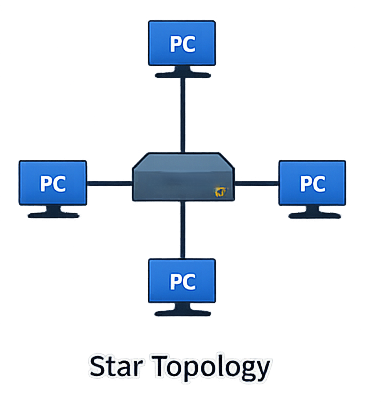
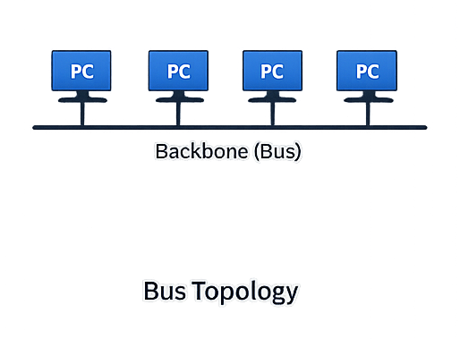
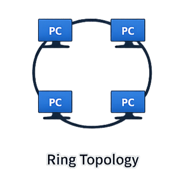

# Network Fundamentals – TryHackMe and Solent University Cybersecurity Coursework 

Platform: TryHackMe     
Level:  Beginner / Foundation  
Focus Area: Network Topologies

## 🎯 Objective
- Understand how devices are physically and logically arranged in a network  
- Learn how different topologies affect performance and reliability  
- Identify strengths and weaknesses of common network designs

## 🧠 Core Concepts Learned 
### Local Area Network (LAN) Topologies
- A network topology defines how devices are **connected and communicate** within a network.
- Different topologies affect network performance, reliability, and fault tolerance

#### Star Topology
- All devices are connected to a **central device** (usually a switch or hub)
- Most common topology in modern networks because of its reliability and scalability

  

**Advantages:**
- Easy to manage and troubleshoot  
- Failure of one device does not affect others  
- Easy to add more devices if the demand for the network increases  

**Disadvantages:**
- If the central device fails, the whole network goes down  
- Requires more cabling, which makes the cost higher
- Larger networks require more maintenance 

---

#### Bus Topology
- All devices share a **single communication line (bus)**  

  

**Advantages:**
- Simple to connect and low cost  
- Requires less cabling 

**Disadvantages:**
- If the backbone cable fails, the entire network fails  
- Performance decreases as more devices are added  
- Difficult to troubleshoot

---

#### Ring Topology
- Devices are connected to each other in a **closed loop (circle)**  
- Data travels in one direction around the ring from device to device
- Every device will prioritise its data first and will send other information after

  

**Advantages:**
- No data collisions  
- Predictable performance  
- Cost-efficient 

**Disadvantages:**
- If one device or connection fails, the entire network is affected  
- Harder to maintain and scale  

## 🧪 TryHackMe Lab Example (LAN Topologies)
- Explored different LAN topologies and tested their weaknesses in a simulated environment  

### Tasks Performed:
- Analysed various network topologies (star, bus, ring)  
- Identified single points of failure in each topology  
- Simulated failures to observe how networks break and stop functioning  
- Retrieved a flag by successfully disrupting the network  

### Key Insight:
- Different network topologies have unique strengths and weaknesses  
- Failure of a critical component can disrupt the entire network  
- Understanding topology helps identify potential attack targets and improve network resilience  

## 🛠️ Practical Skills Developed
- Identifying different network topologies  
- Understanding how topology affects performance and reliability  
- Reading and interpreting network diagrams  
- Recognising advantages and limitations of each topology  

## 🧰 Tools Used 
- Solent University Cybersecurity Coursework  
- TryHackMe Platform  

## 🔐 Security Relevance
- Network topology affects how attacks spread within a network  
- Centralised topologies (Star) create critical points of failure  
- Poor network design can increase attack surface  
- Understanding topology helps identify weak points in infrastructure  

## 📌 Lessons Learned  
⚠️ Network design directly impacts performance and security  
⚠️ Centralised devices can become single points of failure  
⚠️ Different topologies have trade-offs between cost, reliability, and scalability  