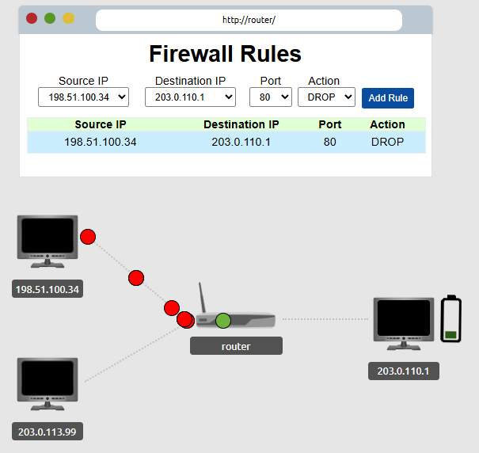

# Network Fundamentals – TryHackMe and Solent University Cybersecurity Coursework 

Platform: TryHackMe   
Level: Beginner / Foundation  
Focus Area: Firewalls 

## 🎯 Objective
- Understand what a firewall is and how it controls network traffic  
- Learn how firewall rules are used to allow or block communication  
- Identify different types of firewalls and their security role

## 🧠 Core Concepts Learned 
- Is a security system that monitors and filters network traffic using rules
- It can allow or block incoming and outgoing traffic  
- Often integrated as a function of a **router**
    - Home Router: Router + Firewall + NAT + Switch + Wi-fi

### What Does a Firewall Check?
- Where traffic is coming from and where is going? 
- Which port is the traffic for? 
- Which protocol is the traffic using? 
- Whether the traffic matches allowed rules  

⚠️ Firewalls perform packet inspection to determine the answers to these questions
⚠️ Administrators can configure the device to permit or deny traffic for entering or exiting a network

### Types of Firewalls
- **Hardware Firewall** → Built into routers and network devices  
- **Software Firewall** → Installed on devices (Windows Defender Firewall)  
- **Cloud Firewall** → Used in cloud platforms (AWS, Azure, Google Cloud)  
- **Network Firewall** → Protects entire networks (Corporate environments)  
- **Host-based Firewall** → Protects individual devices  

### How Firewalls Work 

**Stateful firewall**
  - Determines the behaviour of a device based upon the entire connection (session) 
  - Because it uses the entire information from a connection, consumes more resources than **Stateless firewall**
  - If a connection is identified as malicious, it can block the entire session 

**Stateless firewall**
  - Inspect the header of each packet and comperes them to static rules to determine if are eligible
  - If a device sends a bad packet will not get blocket entirely
  - This firewall is considered simple and fast, but less aware of context 

## 🧪 TryHackMe Lab Example (Firewall Rules)
- Configured firewall rules to control network traffic based on port and destination  

### Tasks Performed:
- Identified malicious traffic targeting a web server (203.0.110.1)  
- Created a firewall rule to block traffic on port 80 (HTTP)  
- Applied the rule to prevent malicious packets from reaching the server  

### Key Insight:
- This demonstrates how network security controls can be used to prevent unauthorised or harmful traffic from reaching systems  
- Firewalls filter traffic based on rules such as IP address, port, and protocol  
- Blocking a specific port can prevent certain types of attacks  
- Firewall rules apply to all matching traffic, not just malicious packets

  <strong>Firewall Rules</strong> 
  
   

## 🛠️ Practical Skills Developed
- Understanding how firewall rules control network traffic  
- Recognising how traffic is filtered based on ports and protocols  
- Differentiating between firewall types and behaviours 

## 🧰 Tools Used 
- Solent University Cybersecurity Coursework 
- TryHackMe platform  

## 🔐 Security Relevance
- Understanding how firewall rules control network traffic  
- Recognising how traffic is filtered based on ports and protocols  
- Differentiating between firewall types and behaviours  

## 📌 Lessons Learned  
⚠️ Firewalls act as the first line of defence in a network  
⚠️ Block unauthorised access and malicious traffic  
⚠️ Misconfigured rules can expose systems to attacks  
⚠️ Commonly used to restrict access to sensitive services   