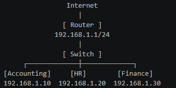
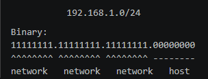

# Network Fundamentals – TryHackMe and Solent University Cybersecurity Coursework 

Platform: TryHackMe   
Date Started: 07.02.2026  
Level:  Beginner / Foundation  
Focus Area: Subnetting

## 🎯 Objective
- Develop a clear understanding of how subnetting is applied in real-world networks
- How IP addresses are structured
- How networks are divided efficiently
- How to calculate usable hosts for performance and security purposes

## 🧠 Core Concepts Learned 
### Subnetting 
- **Subnetting** is the process of dividing a network into smaller sub-networks.
- In real-world environments (SOC, enterprise networks), subnetting is used to separate departments, servers, and sensitive systems.

**Why do we use subnetting?** 
- Control network traffic  
- Improve security  
- Organise network structure efficiently    
- Improve performance  
- Isolate systems  
- Manage access  
- Scale networks  

  <strong>Subnetting Example</strong>  
  

### **Subnet Mask**
- Determines how many hosts can exist in a network
- Tells a device which part of the IP Address is the network and which is the device
- Using the Subnet Mask the device knows if the information needs to go local or proceed further to the router 

**CIDR notation (Classless Inter-Domain Routing)**
- An IP address has 32 bits in total.  
/24 means the first 24 bits are used for the network, and the remaining 8 bits are used for hosts.  

- 8 bits for hosts → 2⁸ = 256 total addresses  
But:     
 - 192.168.1.0   = network address  
 - 192.168.1.255 = broadcast address    
 - Result: 254 usable devices  

  <strong>Subnet Mask Example</strong> 
  
    

 

<strong>CIDR Subnet Reference Table</strong> 
<table>
  <tr>
    <th>CIDR</th>
    <th>Total IPs</th>
    <th>Usable Hosts</th>
  </tr>
  <tr>
    <td>/24</td>
    <td>256</td>
    <td>254</td>
  </tr>
  <tr>
    <td>/25</td>
    <td>128</td>
    <td>126</td>
  </tr>
  <tr>
    <td>/26</td>
    <td>64</td>
    <td>62</td>
  </tr>
  <tr>
    <td>/27</td>
    <td>32</td>
    <td>30</td>
  </tr>
  <tr>
    <td>/28</td>
    <td>16</td>
    <td>14</td>
  </tr>
  <tr>
    <td>/29</td>
    <td>8</td>
    <td>6</td>
  </tr>
  <tr>
    <td>/30</td>
    <td>4</td>
    <td>2</td>
  </tr>
</table>

⚠️ Every time CIDR increases by 1, the number of available IP addresses is halved

 

**Common Subnet Sizes and Use Cases**
- /24 → one large network (254 usable devices)
- /26 → divides a /24 network into 4 smaller networks (62 hosts each)
- /30 → used for point-to-point links (only 2 usable IPs)

### Worked Example
**Example: 192.168.1.0/26**  
A **/26** subnet means: 
  - Total of 32 bits in an IPv4 address  
  - First 26 bits are used for the network  
  - Last 6 bits are left for hosts  

**Step 1: Calculate total addresses**  

2⁶ = 64 total IP addresses  

**Step 2: Calculate usable hosts**  

Reserved addresses:  
192.168.1.0 → Network address  
192.168.1.63 → Broadcast address  

64 total addresses - 2 reserved addresses = 62 usable hosts  

**Step 3: Identify host range**  

Usable host range:  
192.168.1.1 to 192.168.1.62  

**Summary**
- Subnet Mask: 255.255.255.192
- Total IPs: 64
- Usable Hosts: 62
- Network Address: 192.168.1.0
- First Host: 192.168.1.1
- Last Host: 192.168.1.62
- Broadcast Address: 192.168.1.63

## 🛠️ Practical Skills Developed
- Calculated the number of usable hosts based on CIDR notation
- Identified network and broadcast addresses in different subnets
- Practiced dividing a /24 network into smaller subnets (/25, /26, /27, etc.)
- Understood how subnet masks affect traffic flow and routing decisions
- Applied subnetting concepts in TryHackMe lab environments
- Improved logical thinking when working with binary calculations

## 🧰 Tools Used 
- Solent University Cybersecurity Coursework  
- TryHackMe Platform  

## 🔐 Security Relevance
- Subnetting plays a critical role in cybersecurity:
  - Network segmentation → Limits the spread of attacks inside a network
  - Access control → Different subnets can have different permissions and firewall rules
  - Attack surface reduction → Smaller networks mean fewer reachable devices
  - Monitoring & detection → Easier to identify suspicious activity within segmented networks
  - Containment → If one subnet is compromised, others remain isolated

## 🧠 Lessons Learned  
⚠️ Subnetting is not just math — it’s logic
- At first it looks like calculations, but it’s really about understanding how networks are structured.

⚠️ Small mistakes = big problems
- Misconfiguring a subnet can break communication or expose systems unintentionally.

⚠️ Practice is essential
- Subnetting only becomes easy after repetition — especially CIDR and host calculations.

⚠️ Subnetting is used daily in networking and cybersecurity roles to manage and secure networks 