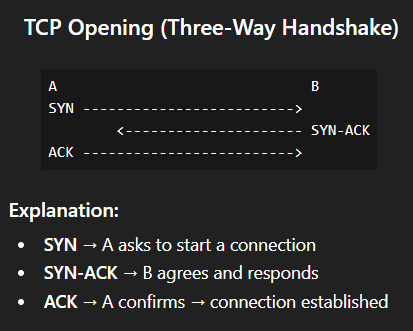
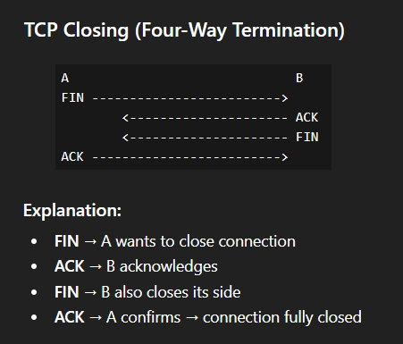

# Network Fundamentals – TryHackMe and Solent University Cybersecurity Coursework 

Platform: TryHackMe   
Date Started: 11.02.2026  
Level: Beginner / Foundation  
Focus Area: Network Protocols 

## 🎯 Objective
- Develop a clear understanding of how key network protocols operate and interact  
- Learn how devices communicate across networks
- Identify the role of protocols in troubleshooting and security

## 🧠 Core Concepts Learned 

### Internet Protocol (IP)
- Responsible for addressing and routing packets between devices  
- Uses IP addresses to identify hosts on a network  
- Operates at Layer 3 (Network layer)

---

### TCP (Transmission Control Protocol)
- Developed in the early 1970s as part of the TCP/IP model  
- Operates at the Transport Layer (Layer 4) of the networking model  
- This protocol is a core communication standard that allows computer applications and devices to exchange data reliably over a network  

#### Key Features
- It is connection-based, meaning it establishes a formal connection between two parties before any data is sent and maintains it until the exchange is over  
- Uses congestion control to adjust data transmission based on network conditions  
- TCP guarantees the delivery of data and packets in the same order as they were sent, ensuring that packets are delivered correctly and error-free  
- If a segment is lost or corrupted, TCP detects the error and automatically requests a retransmission (reliability)  

#### Three-Way Handshake
- Process used to establish a connection between two devices before sending data
- Devices communicate using special messages that contain sequence numbers 

**SYN** - "I want to connect"
  - This message is the initial packet sent by a client to server during the handshake
  - Used to initiate the connection and synchronise the two devices together

**SYN / ACK** - "Got it. Ready!"
  - This is a packet sent by the receiving device (server) to acknowledge the client attempt

**ACK** - "Confirmed. Let's go!"
  - Now client side acknowledge server's **SYN** and responds with **ACK** and data transfer can begin

Continuing the process:   
**DATA** 
  - After the successful connection has been established, information (as bytes of a file) can be sent via the "Data message"

**FIN**
  - This packet is used to properly close the connection after it has been complete

**RST**
  - This packet ends all communication in case of a problem during the process
  - Is the last resort in case that service or application is not working correctly, or the system has low resources

#### How it works
1. SYN 
   - Client: Here's my ISN (Initial Sequence Number) to synchronise = 0 
2. SYN/ACK 
   - Server: Here's my ISN (Initial Sequence Number) to synchronise = 5000
3. ACK  
   - Client: I acknowledge your ISN = 5000, here is my data ISN + 1 (0 + 1)
   - Server: I acknowledge your ISN = 0, here is my data ISN + 1 (5000 + 1)

⚠️ The random number sequence sent through these messages is reconstructed using the initial number + incrementing by 1  
⚠️ Reliability comes from agreement and tracking

<table align="center">
  <tr>
    <td align="center">
      <strong>TCP Opening (3-Way Handshake)</strong>  
      
    </td>
    <td align="center">
      <strong>TCP Closing (4-Way Termination)</strong>  
      
    </td>
  </tr>
</table>

#### Common Applications
- Web browsing (HTTP/HTTPS) 
- Email  
- File transfers (FTP)   

---

### UDP (User Datagram Protocol)
- Another method for devices to communicate data between them
- Ideal for scenarios where speed matters more than accuracy

#### Key Features  
- UDP sends messages (datagrams) without establishing a formal connection (no handshake and no synchronisation)
- Does not guarantee delivery or order (no reliability)
- UDP packets have a smaller header (8 bytes), reducing overhead and allowing faster transmission

#### Common Applications
- Streaming (video/audio)  
- Online gaming  
- DNS queries  

---

### Dynamic Host Configuration Protocol (DHCP)
- Automatically assigns devices IP addresses and other network settings when they join a network
- Without DHCP, we would have to manually assign an IP, subnet mask, gateway, DNS

#### **How DHCP works?**
- **DHCP DISCOVER**
  - When a device connects to a network it sends out a **request** to see if any DHCP servers are on the network

- **DHCP OFFER** 
  - DHCP server **replies** back with an IP Address the device could use

- **DHCP REQUEST**   
  - The device sends a reply confirming that it wants the offered IP Address

- **DHCP ACK**
  - As final step, DHCP server sends a reply acknowledging that the process has been complete, and the device can start now using the IP address

#### **Why is it important?**
- Prevents IP conflicts 
- The IPs are temporary (leases)
- Makes networks plug-in-play 

--- 

### Internet Control Message Protocol (ICMP)
- A protocol used by network devices to send **error messages and operational information**
- Helps diagnose network issues and check connectivity
- Works alongside IP, but does not carry user data
- ICMP operates at Layer 3 (Network layer) of the OSI model
- Common ICMP messages include "Echo Request" and "Echo Reply" (used by ping)

#### Network Diagnostic Tools:
**ping** 
- One of the most fundamental network tools available
- Uses ICMP packets to check if a device is reachable and how reliable the connection is
- Measures latency (response time)
- Can indicate packet loss (network instability)
- It works on devices on the network, or resources like websites

⚠️ May be blocked by firewalls, so failure does not always mean the host is down  

**ipconfig (Windows) / ifconfig (Linux or macOS)**
- Shows your network configuration (IP address, subnet mask, gateway)  
- Helps identify network misconfigurations  
- Useful for troubleshooting connectivity issues 

**tracert (Windows) / traceroute (Linux or macOS)** 
- Shows the path packets take through the network  
- Helps identify where delays or failures occur  
- Useful for diagnosing routing problems  

⚠️ Uses ICMP (or UDP depending on implementation)  

**nslookup**
- Queries DNS servers to resolve domain names to IP addresses  
- Helps detect DNS issues or misconfigurations  
- Useful for identifying suspicious or malicious domains  
- Very useful for security investigations

**netstat**
- Shows active network connections and listening ports  
- Helps identify unusual or suspicious connections  

⚠️ Useful for detecting malware communication, backdoors, and exposed services

**arp**
- Displays the mapping between IP addresses and MAC addresses  
- Used to identify devices on the local network  

⚠️ Useful for detecting ARP spoofing attacks and identifying unknown devices 

## 🛠️ Practical Skills Developed
- Tested connectivity using ping  
- Analysed network paths using traceroute  
- Checked system configuration with ipconfig  
- Observed protocol behaviour in TryHackMe labs  

## 🧰 Tools Used 
- Solent University Cybersecurity Coursework  
- TryHackMe Platform  

## 🔐 Security Relevance
- Protocols define how data moves across networks  
- Attackers exploit protocol weaknesses (e.g. UDP flooding, ICMP abuse)  
- Monitoring tools help detect abnormal behaviour  
- Understanding protocols is essential for traffic analysis  

## 📌 Lessons Learned  
⚠️ Protocols work together, not individually  
- Understanding the interaction between IP, TCP, and UDP is essential  

⚠️ Not all network failures mean the system is down  
- Tools like ping can be blocked by firewalls  

⚠️ Simplicity vs reliability trade-off  
- UDP is fast but unreliable, TCP is slower but reliable  

⚠️ These concepts are directly used in real-world cybersecurity roles  