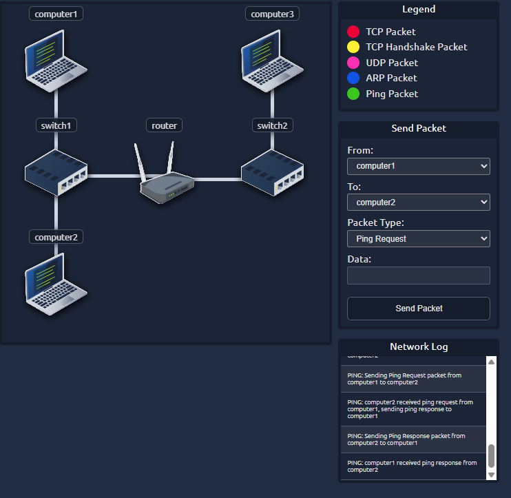

# Network Fundamentals – TryHackMe and Solent University Cybersecurity Coursework 

Platform: TryHackMe   
Level: Beginner / Foundation  
Focus Area: Packets and Frames 

## 🎯 Objective
- Understand the difference between packets and frames  
- Learn how data is structured at different OSI layers  
- Identify how packets and frames relate to real-world networking and security  

## 🧠 Core Concepts Learned 

### Packets 
- Is a unit of data that contains control information (header) and payload
- Used to route data across different networks (Internet communication)
- Is part of the Network Layer (3)
- Handled by routers

**Packet structure includes:**
- Source IP
- Destination IP
- TTL (Time-to-Live)
- Protocol information (TCP/UDP)
- Checksum 

⚠️ TTL (Time-to-Live) 
- Limits how long a packet can exist in the network  
- Prevents network congestion if packets fail to reach their destination 

⚠️ Checksum 
- Used to detect errors in the packet header  
- If data is corrupted, the packet may be discarded  

### Frames
- A frame is a unit of data at the Data Link Layer (2)  
- Encapsulate the packet and adds additional information like the MAC address, and moves data inside a local network (LAN)
- Handled by switches

**Frame structure includes:**
- Source MAC 
- Destination MAC
- Payload (the packet)
- Frame Check Sequence (FCS) for error detection

#### Key Difference: Packet vs Frame
⚠️ Packet → used for communication across networks (Layer 3)  
⚠️ Frame → used for communication within a local network (Layer 2)  
⚠️ Packets use IP addresses, while frames use MAC addresses  

#### Encapsulation Relationship
- Data is created → becomes a **packet** → part of Layer 3  
- Packet is encapsulated into a **frame** → part of Layer 2  
- Frame is transmitted as **bits** to Layer 1  

#### TCP vs UDP Packets
**TCP Packet:**
- Connection-oriented  
- Reliable (acknowledgements, retransmissions)  
- Ordered delivery  

**UDP Packet:**
- Connectionless  
- No guarantee of delivery  
- Faster with less overhead  

## 🧪 TryHackMe Lab Example (TCP / UDP Network Simulation)
- Used a network simulator to visualise how packets travel across a network from source to destination  

### Tasks Performed:
- Sent a **TCP packet** from Computer1 to Computer3  
- Observed the **TCP handshake process** before data transmission  
- Sent a **UDP packet** between devices to compare behaviour  
- Tracked how packets moved through **switches and a router**  
- Retrieved a flag after successful packet delivery  

### Key Observations:
- TCP establishes a connection before sending data, ensuring reliable delivery  
- UDP sends packets without establishing a connection, making it faster but less reliable  
- Packets are forwarded through multiple devices (switch → router → switch) before reaching the destination  
- Each network device makes forwarding decisions based on addressing information  

💡 Network communication is a multi-step process involving multiple devices, not a direct connection between two computers  
💡 Understanding how TCP and UDP behave helps identify unusual traffic patterns and detect potential network-based attacks    

  <strong>Network Packet Flow Simulation</strong>  
  

## 🛠️ Practical Skills Developed
- Understanding how data is structured and transmitted across networks  
- Differentiating between packets and frames  
- Interpreting basic network communication concepts

## 🧰 Tools Used 
- Solent University Cybersecurity Coursework 
- TryHackMe platform  

## 🔐 Security Relevance
- Packet manipulation can be used in attacks (IP spoofing)  
- Frame-level attacks include ARP spoofing and MAC flooding  
- TTL and packet structure are useful in network scanning and analysis  
- Understanding packets is essential for tools like Wireshark  

## 📌 Lessons Learned  
⚠️ Data is not sent as one continuous stream, but broken into structured units  
⚠️ Different OSI layers handle data in different formats (frames, packets, bits)  
⚠️ Understanding packet structure is key to analyzing and securing networks  