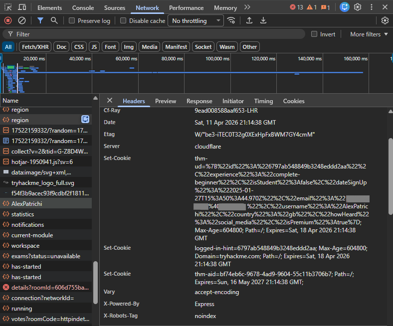

# Web Fundamentals – TryHackMe and Solent University Cybersecurity Coursework 

Platform: TryHackMe   
Level: Beginner / Foundation  
Focus Area: Cookies

## 🎯 Objective 
- Understand what cookies are and how they are used in web applications  
- Learn how cookies maintain state between client and server  
- Identify common uses of cookies such as sessions, preferences, and tracking  
- Understand how cookies are transmitted using HTTP headers  
- Recognise the security risks associated with cookies  

## 🧠 Core Concepts Learned 

## Cookies
- Cookies are small pieces of data stored by the browser on the client’s device  
- Cookies are set by the server using the **Set-Cookie** header  
- The browser automatically sends cookies back to the server in future requests using the **Cookie** header   

## Common Uses of Cookies
- **Login Sessions:**
  - Allow users to stay authenticated without logging in on every page  

- **Preferances:**
   - Store settings such as language, theme, dark mode settings

- **Shopping Cart:** 
  - Keep track of selected items across multiple pages  

- **Tracking:**
  - Used for analytics, advertising, and user behaviour monitoring  

## 🧪 TryHackMe Lab Example (Cookies & Developer Tools)
- Used browser developer tools to inspect cookies and HTTP requests  

### Tasks Performed:
- Opened browser developer tools and navigated to the **Network** tab  
- Monitored requests made by the browser when accessing a website  
- Selected individual requests to analyse their details  
- Viewed cookies sent by the browser in the **Cookies** section  

### Key Insight:
- Cookies are automatically included in HTTP requests  
- Servers use **Set-Cookie** headers to store data in the browser  
- Developer tools provide visibility into request and response data     
- Analysing request and response data helps identify how websites handle user information  

  <strong>Inspecting HTTP Response Headers and Cookies in Developer Tools</strong>  
  

## 🧪 Practical Application  
- After learning how cookies are used for tracking and session management, I made a practical change by switching from Google Chrome to Mozilla Firefox.  

### Reasoning:
- Firefox provides stronger privacy protection by default  
- Better control over cookies and site permissions  
- Built-in tracking protection that blocks third-party cookies and trackers  

### Actions Taken:
- Switched primary browser to Firefox  
- Enabled enhanced tracking protection  
- Configured settings to block third-party cookies  

### Security Impact:
- Reduced exposure to tracking cookies and behavioural profiling  
- Limited data collection by third-party services  
- Improved control over stored browser data and sessions  

💡 Understanding how cookies work led me to take practical steps to improve my privacy and security.

## 🛠️ Practical Skills Developed
- Identifying cookies in browser developer tools  
- Understanding how cookies are sent and received via HTTP headers  
- Analysing how sessions are maintained in web applications     

## 🧰 Tools Used 
- Solent University Cybersecurity Coursework 
- TryHackMe platform
- Developer Tools  

## 🔐 Security Relevance
- Cookies are often used to store **session identifiers**, making them a target for attackers  
- If intercepted, cookies can be used in **session hijacking attacks**   
- Improperly configured cookies can expose sensitive user data     

## 📌 Lessons Learned  
⚠️ They are essential for authentication and user experience  
⚠️ Improper handling of cookies can lead to serious security vulnerabilities  