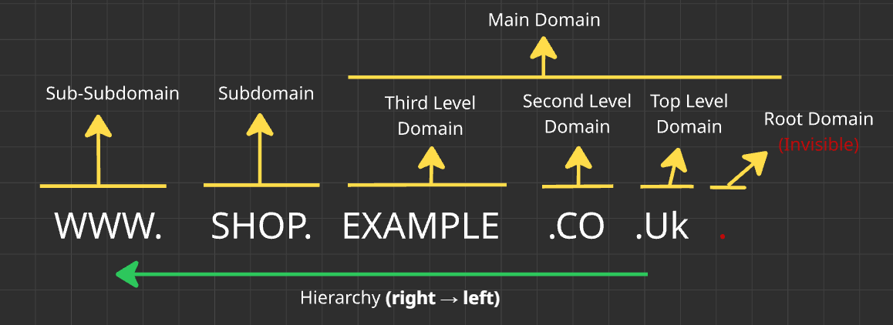
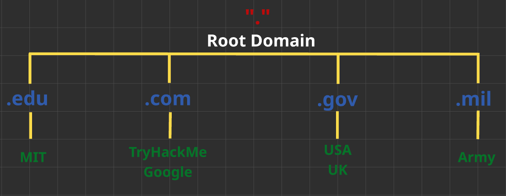

# How the Web Works – TryHackMe and Solent University Cybersecurity Coursework 

Platform: TryHackMe   
Level: Beginner / Foundation  
Focus Area: DNS in detail 

## 🎯 Objective
- Understand how DNS translates domain names into IP addresses
- Learn how domain hierarchy is structured
- Identify the role of DNS in web communication and security

## 🧠 Core Concepts Learned 

## Domain Name System (DNS)
DNS is a system that translates human-readable domain names into IP addresses.  
- Humans prefer to use: `www.google.com`
- Computers use IP addresses: `142.250.74.206`

### How DNS Works 
1. You type `www.google.com` into your browser  
2. Your device queries a DNS server: "What is the IP address for this domain?"
3. DNS responds with the correct IP address
4. Your browser connects to that IP address
5. The website loads

⚠️ The entire process takes milliseconds

### Domain Hierarchy
DNS is hierarchical, meaning each level can delegate authority to the level below it.  

⚠️ Domain names are read from right → left, with the rightmost part being the most authoritative.

  <strong>DNS Hierarchy Example</strong>  
  

#### TLD (Top-Level Domain)
The TLD is the highest level in the DNS hierarchy (just below the root domain ".").   
Controlled by **ICANN (Internet Corporation for Assigned Names and Numbers)**, which manages global domain name systems.   

**Types of TLD:**   
**gTLD - Generic Top Level Domain**  
- Shows the domain name's purpose:  
    - `.com` - commercial use
    - `.org` - for organisations use
    - `.edu` - for education use
    - `.gov` - for government use

⚠️  Due to high demand, there is an influx of new gTLDs (`.online` , `.club`, `.website`, `.biz`) 

**ccTLD - Country-Code Top Level Domain**
- Used for geographical purposes: 
    - `.co.uk` - for sites based in the United Kingdom
    - `.ca` - for sites based in Canada   

⚠️ Note: Some countries use structured domains such as `.co.uk`, where `.co` is a second-level domain under `.uk`.  

#### SLD (Second-Level Domain)   
The second-level domain is the part directly to the left of the TLD.  
When registering a domain name, the second-level domain is limited to:
- Up to 63 characters  
- Allowed characters: a–z, 0–9, and hyphens (-)

**Example:**  
In `example.com` → `example` is the SLD  

⚠️ In structured domains like `example.co.uk`, `example` is still the registered domain, even though `.co` appears as an additional level.  

#### Subdomain
Subdomains are used to organise different sections or services of a website.  

**Examples:**  
- `shop.example.com`
- `fr.example.com`

They remain part of the main domain and can be created freely by the domain owner.

  <strong>Domain Hierarchy</strong>  
  

## 🛠️ Practical Skills Developed
- Understood how DNS resolves domain names to IP addresses
- Identified the structure of domain names and hierarchy
- Recognised differences between TLDs, SLDs, and subdomains

## 🧰 Tools Used 
- Solent University Cybersecurity Coursework 
- TryHackMe platform  

## 🔐 Security Relevance
Understanding DNS is critical in cybersecurity, as attackers frequently exploit domain structures.
- **Phishing attacks:** Malicious domains mimic legitimate ones (e.g., go0gle.com)
- **Subdomain abuse:** Attackers may take over unused or misconfigured subdomains
- **DNS Spoofing:** Redirects users to malicious IP addresses
- **Domain analysis:** Security analysts investigate domains to detect suspicious activity

A strong understanding of DNS helps identify threats and analyse network traffic effectively.

## 📌 Lessons Learned  
⚠️DNS is a fundamental part of how the internet works, but also a common target for cyber attacks.
⚠️ Understanding domain structure helps in identifying malicious or suspicious domains.      