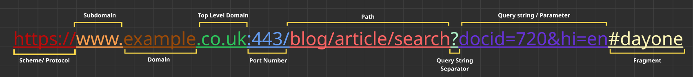
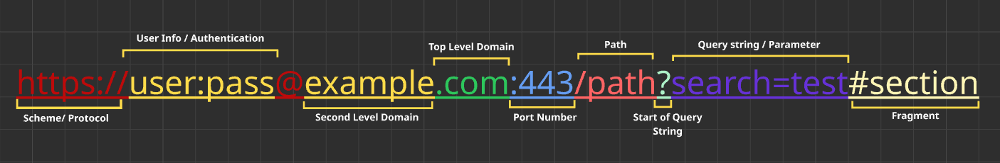

# How the Web Works – TryHackMe and Solent University Cybersecurity Coursework 

Platform: TryHackMe   
Level: Beginner / Foundation  
Focus Area: HTTP in detail

## 🎯 Objective
- Understand how HTTP and HTTPS enable communication between clients and web servers  
- Learn how requests and responses are structured and exchanged  
- Identify and explain the components of a URL and how they are used to locate resources  
- Recognise the differences between HTTP protocol versions and their impact on performance  
- Understand the security implications of web communication, including encryption and data exposure

## 🧠 Core Concepts Learned 
### HyperText Transfer Protocol (HTTP)
- Defines the rules used for communication between a client (browser) and a web server
- Used to transfer web resources such as HTML, images, and videos

### HyperText Transfer Protocol Secure (HTTPS)
- The secure version of HTTP that uses encryption (TLS)
- Protects data in transit and ensures communication with the correct server

### Request and Responses
- A client (browser) sends a request to a web server for resources
- The client requires a **URL** to identify and access these resources
- The server processes the request and returns a response
- Resources can include HTML pages, images, videos, or files

### Uniform Resource Locator (URL)
- A **URL** is an instruction that specifies how to access a resource on the internet

  <strong>URL Structure</strong>  
  

 

  <strong>Full URL Structure</strong>  
  

- Scheme / Protocol:
    - Instructs on what protocol to use for accessing the resources such as HTTP/s or FTP 
- User Info / Authentication: 
    - Optional credentials included in the URL  
    ⚠️ Rare and insecure in modern systems
- Host:
    - The domain name or Ip address of the server you wish to log in
- Port: 
    - Specifies the communication endpoint, usally 80 (HTTP) or 443 (HTTPS)
- Path: 
    - File name or location of the requested resource on the server
- Querry String:
    - Extra bits of information that can be sent to the requested path
    - Additional parameters sent to the server (e.g., search filters or IDs)
- Fragment: 
    - Refers to a specific section within the requested page
    - This process happens on client side

### HTTP Versions
- **HTTP/1.1**
    - Widely supported and stable version of HTTP
    - Replaced **HTTP/1.0** to fix limitations like faster loading, more connections, more features

⚠️ **HTTP/2** and **HTTP/3** are widely used and provide significant performance improvements over **HTTP/1.1**, including faster data transfer and reduced latency.    
⚠️ However, **HTTP/1.1** remains widely supported for compatibility with older systems and infrastructure.  

## 🛠️ Practical Skills Developed
- Identifying and analysing URL components
- Understanding how web requests are structured
- Recognising how data is transmitted between client and server

## 🧰 Tools Used 
- Solent University Cybersecurity Coursework 
- TryHackMe platform  

## 🔐 Security Relevance
- HTTPS encryption protects data from interception (e.g., Man-in-the-Middle attacks)
- Query strings can expose sensitive data if improperly used
- User credentials in URLs are insecure and may be logged or cached
- Ports can reveal exposed services and increase attack surface
- Fragments (#) are handled client-side and not transmitted to the server

## 📌 Lessons Learned  
⚠️ Understanding URL structure is essential for analysing web traffic   
⚠️ Secure communication (HTTPS) is critical for protecting user data   
⚠️ Even small components of a URL can have security implications      