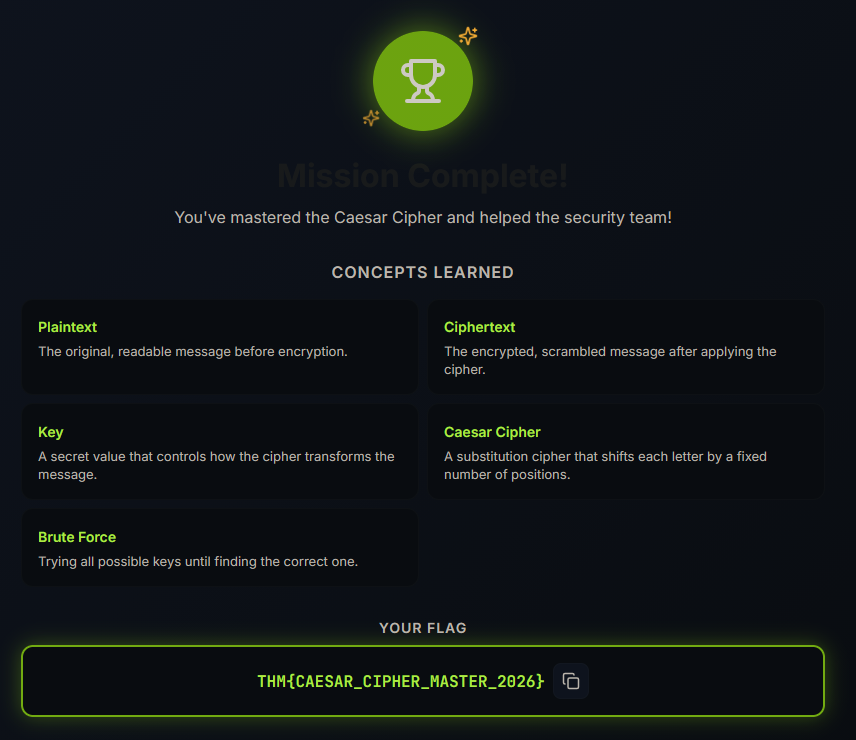
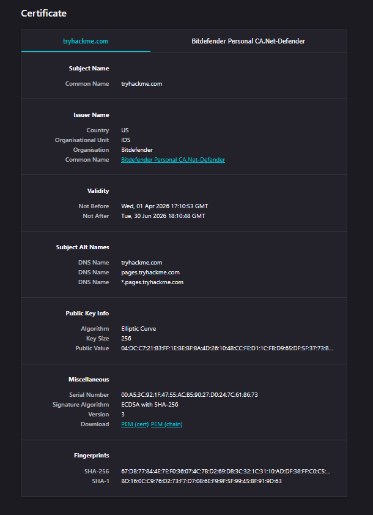

# Security Fundamentals - TryHackMe and Solent University Cybersecurity Coursework 

Platform: TryHackMe  
Skill Level: Beginner / Foundation  
Focus Area: Encryption (Symmetric vs Asymmetric)

## 🎯 Objective
- Understand the difference between symmetric and asymmetric encryption  
- Learn how keys are used to encrypt and decrypt data  
- Identify real-world uses of encryption  

## 🧠 Core Concepts Learned
## Encryption Types
- Encryption protects data by transforming it into unreadable form  
- It ensures confidentiality during storage and transmission  

---

### Symmetric Encryption
- Uses the **same key** for encryption and decryption  

**Key Characteristics:**
- Fast and efficient  
- Suitable for large amounts of data  
- Requires secure key sharing  

⚠️ **Problem:**
- Key distribution problem  
  - The key must be shared securely before communication  
  - If intercepted, all communication can be decrypted  

**Examples:**
- AES (Advanced Encryption Standard)    

## 🧪 TryHackMe Lab Example  

**Hands-on Scenario:**
- Used Caesar cipher to encrypt and decrypt messages  
- Adjusted keys to observe how ciphertext changes  

👉 This demonstrates how keys control the encryption process  

  

 

---

### Asymmetric Encryption
- Uses **two different keys**:
  - Public key → used to encrypt  
    - Anyone can know and use this key
  - Private key → used to decrypt  
    - Only the owner knows this key

⚠️ The keys are mathematically linked, but the private key cannot be derived from the public key

**Key Characteristics:**
- More secure for key exchange  
- Slower than symmetric encryption  
- Eliminates the need to share a secret key  

**Example:**
- RSA  

💡 Anyone can use the public key to encrypt data, but only the owner can decrypt it using the private key  
💡 Private keys are also used to create digital signatures, which can be verified using the public key

---

### How They Work Together
- Asymmetric encryption is used to securely exchange a key  
- Symmetric encryption is then used for fast data transfer  

💡 This combination is used in real-world systems like HTTPS  

### Example: HTTPS & Certificates
**Asymmetric:** 
- Browser requests server’s public key   
- Server sends certificate (with public key) 
- Browser verifies certificate  
- Secure key is established  

**Symmetric**
- Data transfer begins using session key  

💡 Asymmetric encryption secures the connection setup, while symmetric encryption handles the data 
💡 This process ensures the browser connects to the legitimate website and prevents man-in-the-middle attacks

  

 

## 🛠️ Practical Skills Developed
- Understanding how encryption works using keys  
- Distinguishing between symmetric and asymmetric encryption  
- Identifying encryption methods used in real systems  

## 🧰 Tools Used
- TryHackMe platform  
- Solent University Cybersecurity Coursework  

## 🔐 Security Relevance
- Encryption protects sensitive data during communication (HTTPS, VPNs)  
- Symmetric encryption ensures efficient data protection  
- Asymmetric encryption enables secure key exchange  
- Weak key management can lead to data compromise  

💡 Encryption supports the CIA Triad:
- Confidentiality → protects data from unauthorised access  

## 📌 Lessons Learned
⚠️ Symmetric encryption uses one key, asymmetric uses two  
⚠️ Key distribution is a major challenge in symmetric encryption  
⚠️ Asymmetric encryption solves key exchange problems  
⚠️ Real systems use a combination of both methods  