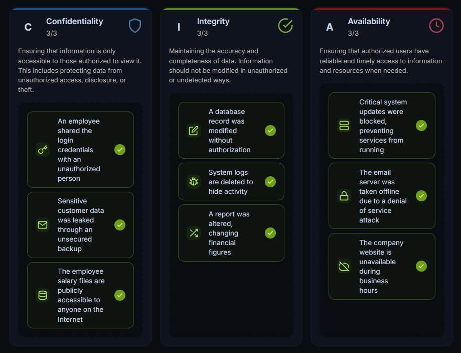

# Attacks and Defenses - TryHackMe and Solent University Cybersecurity Coursework 

Platform: TryHackMe  
Skill Level: Beginner / Foundation  
Focus Area: The CIA Triad

## 🎯 Objective
- Understand the three core principles of cybersecurity: Confidentiality, Integrity, and Availability  
- Learn how these principles are used to analyse security incidents  
- Apply the CIA Triad to real-world scenarios  

## 🧠 Core Concepts Learned

## The CIA Triad
- The CIA Triad is a fundamental model used in cybersecurity to evaluate and protect systems  
- It represents three key security principles:  
  **Confidentiality, Integrity, and Availability**  

💡 It is not just theory — it is a **decision-making framework** used to analyse security incidents   

Security professionals often ask:
- Was sensitive data exposed? → (Confidentiality)  
- Was data altered or tampered with? → (Integrity)  
- Were systems or services unavailable? → (Availability)  

### Confidentiality
- Ensures that sensitive data is only accessible to authorised users  
- Prevents unauthorised access and data leaks  

**Risks if compromised:**
- Data breaches  
- Identity theft  
- Financial and legal consequences  

**Protection methods:**
- Encryption  
- Access control (authentication & authorisation)  

### Integrity
- Ensures that data remains accurate and unmodified  
- Prevents unauthorised changes to information  

**Risks if compromised:**
- Corrupted or misleading data  
- Loss of trust in systems  
- Potential operational or safety risks  

**Protection methods:**
- Hashing  
- File integrity monitoring  
- Access controls  

### Availability
- Ensures that systems and data are accessible when needed  
- Critical for business operations and user access  

**Risks if compromised:**
- Service downtime  
- Financial loss  
- Disruption of operations  

💡 Even if no data is stolen or modified, lack of availability can still cause major damage  

**Protection methods:**
- Redundancy (backup systems)  
- Load balancing  
- DDoS protection  

## 🧪 TryHackMe Lab Example  

**Hands-on Scenario:**
- Analysed multiple security incidents  
- Classified each incident based on the CIA Triad  

  <strong>Hands-on Scenario</strong>  
  

  

👉 This reinforces how the CIA Triad is used in real-world decision-making   

## 🛠️ Practical Skills Developed
- Analysing security incidents using the CIA Triad  
- Identifying which security principle is affected  
- Applying structured thinking to cybersecurity problems  

## 🧰 Tools Used
- TryHackMe platform  
- Solent University Cybersecurity Coursework  

## 🔐 Security Relevance
- The CIA Triad is used to assess and respond to security incidents  
- Helps prioritise security measures in systems and networks  
- Forms the foundation of many cybersecurity frameworks and policies  
- Used in risk assessment, incident response, and system design  

## 📌 Lessons Learned
⚠️ Cybersecurity is not just about tools, it is a security mindse  
⚠️ The CIA Triad provides a structured way to analyse security problems    
⚠️ Every security incident affects at least one part of the triad    
⚠️ Security professionals work to defend these principles, while attackers attempt to compromise them   
⚠️ Understanding these principles is essential for all cybersecurity roles   