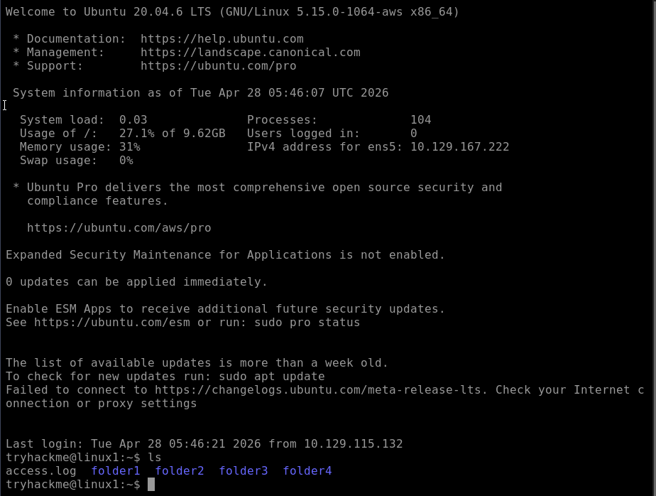

# Linux - TryHackMe and Solent University Cybersecurity Coursework 

Platform: TryHackMe  
Skill Level: Beginner / Foundation  
Focus Area: Linux Commands

## 🎯 Objective
- Understand how to interact with Linux systems using the Command Line Interface (CLI)  
- Learn essential Linux commands for navigation, file management, and system information  
- Recognise how these commands are used in cybersecurity contexts  

## 🧠 Core Concepts Learned 
## Command Line Interface (CLI)  
- Commands are executed by a shell such as Bash 
- The shell interprets commands and interacts with the OS
- Commands can be combined and automated using scripts

💡 The CLI provides more control and efficiency than graphical interfaces and is widely used in cybersecurity   

## Key Directories in Linux
- `~` (Home Directory) → shortcut that represents the current user’s home directory
- `/` → Root directory (top level)
- `/home` → User directories
- `/etc` → Configuration files
- `/var` → Logs and variable data
- `/tmp` → Temporary files

💡 Many logs and sensitive configuration files are stored in these directories, making them important during security investigations  
💡 Understanding these directories is important for system navigation and investigation  

## Linux CLI Commands
### 📂 Navigation
- `pwd` (Print Working Directory) →  shows the current directory

- `ls` (List) → lists files and directories  
⚠️ `ls -l` command will print more details  
⚠️ `ls -al` command will print the hidden files in the directory   
⚠️ These files starts with a . (dot) and are hidden by default  

- `cd` (Change Directory) → changes the current directory  
⚠️ To go back one level use `cd ..` command  

### 📄 File Viewing
- `cat` (Concatenate) → displays the contents of a file  
⚠️ Originally meant to join files together  
⚠️ But in practice, you mainly use it to read files and display content quickly  

### 🔍 File Search
- `find` (Find) → searches for files and directories  
⚠️ More powerful than it looks  
⚠️ Can search by: name, type, size, permissions  
⚠️ Works well with the wildcard (*) 

- `grep` → searches through a file for specific values
⚠️ Commonly used for analysing logs and filtering important data
⚠️ `grep -R` (recursively) search for a variable across all files in the current directory and its subfolders

### ⚙️ System Information
- `whoami` → shows the current user  
- `uname` (Unix Name) → displays basic system information
- `df -h` → disk usage in human-readable format

### 🧾 Output
- `echo` → Output any text that we provide
⚠️ Strings with spaces should be enclosed withing double quotes

### 📁 File Operations
- `cp` → Copy files                           
- `mv` → Move/rename files                
- `rm` → Remove files                         
- `touch` → Create files     
- `wc` → Counts lines, words, and characters in a file or number of entries 
⚠️ `wc -l file.txt` counts lines

💡 These commands are essential for navigating and interacting with the Linux file system  

### 🧪 Interacting with Linux Machine (In-Browser)
- Used `whoami` to identify the current user in the system  
- Used `echo` to display custom messages and understand command syntax
- Used `ls`, `cd`, `pwd` and `cat` to interact with the filesystem
- Used `find` and `grep` to locate and analyse specific data

  

## 🛠️ Practical Skills Developed
- Navigated the Linux file system using CLI commands  
- Located files and directories using search techniques  
- Viewed and analysed file contents from the terminal  
- Performed basic file operations (create, move, delete)  
- Retrieved system and user information from a Linux environment  

## 🧰 Tools Used
- Solent University Cybersecurity Coursework
- TryHackMe platform
- Linux (terminal environment)
- Bash shell

## 🔐 Security Relevance
- CLI is heavily used in penetration testing and system administration  
- Commands like `find` are used to locate sensitive files (passwords, configs)  
- `grep` is essential for analysing logs and identifying suspicious activity
- System info commands help identify potential vulnerabilities  
- File operations are essential for analysing and handling evidence during investigations  

## 📌 Lessons Learned
⚠️ The command line provides more control and efficiency than GUI tools   
⚠️ Small commands can be powerful when combined   
⚠️ Understanding the file system structure is key for both system management and security analysis     