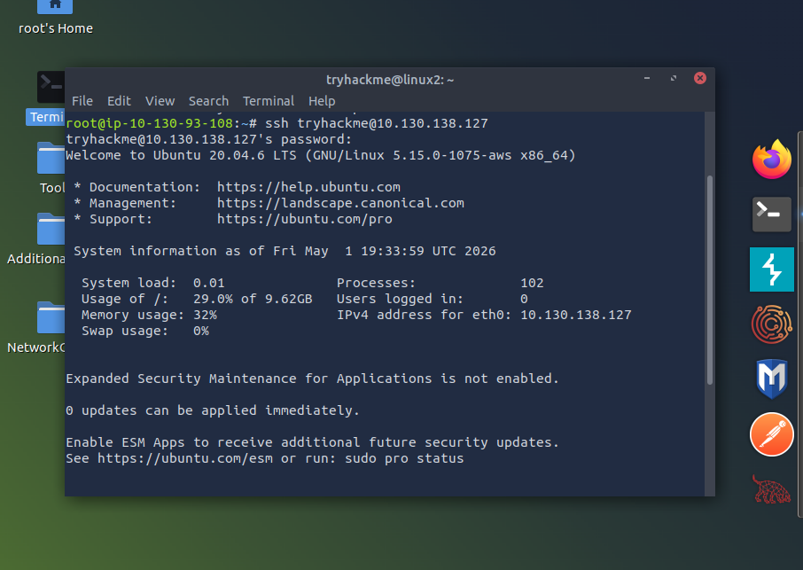

# Linux - TryHackMe and Solent University Cybersecurity Coursework 

Platform: TryHackMe  
Skill Level: Beginner / Foundation  
Focus Area: Secure Shell (SSH)

## 🎯 Objective
- Understand what SSH is and how it enables secure remote access  
- Learn how to connect to a remote machine using SSH  
- Recognise the importance of encrypted communication  

## 🧠 Core Concepts Learned 
## Secure Shell (SSH)
- SSH is a network protocol used to securely connect to remote systems  
- It encrypts data transmitted between devices to protect it from interception  
- Allows users to remotely execute commands on another machine

### 🧪  TryHackMe Lab Example
**Command Used:**
`ssh tryhackme@<target-ip>`

💡 Password input is hidden in the terminal for security (no characters are displayed)

**Actions Performed:**
- Deployed a Linux Machine 
- Opened a terminal in the AttackBox
- Connected to a remote machine using SSH 
- Accepted the host authenticity prompt
- Entered credentials to gain access

**Key Insight:**
- SSH provides a secure way to remotely access and control systems over a network

  

## 🛠️ Practical Skills Developed
- Connected to a remote machine using SSH
- Used credentials to authenticate access
- Executed commands on a remote system
- Understood how secure remote access works

## 🧰 Tools Used
- Solent University Cybersecurity Coursework
- TryHackMe platform
- Linux (terminal environment)
- TryHackMe AttackBox

## 🔐 Security Relevance
- SSH is widely used for secure remote administration of systems
- Encryption protects credentials and commands from being intercepted
- Commonly used by system administrators and cybersecurity professionals
- Misconfigured SSH access can be a major security risk

## 📌 Lessons Learned
⚠️ SSH requires valid credentials — weak passwords can lead to unauthorised access  
⚠️ Always verify the host when connecting for the first time to avoid man-in-the-middle attacks  

💡 SSH is a fundamental tool for managing systems securely in real-world environments