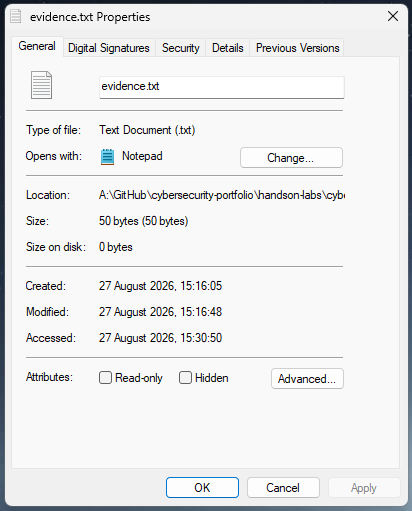
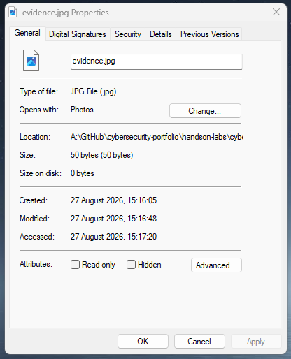
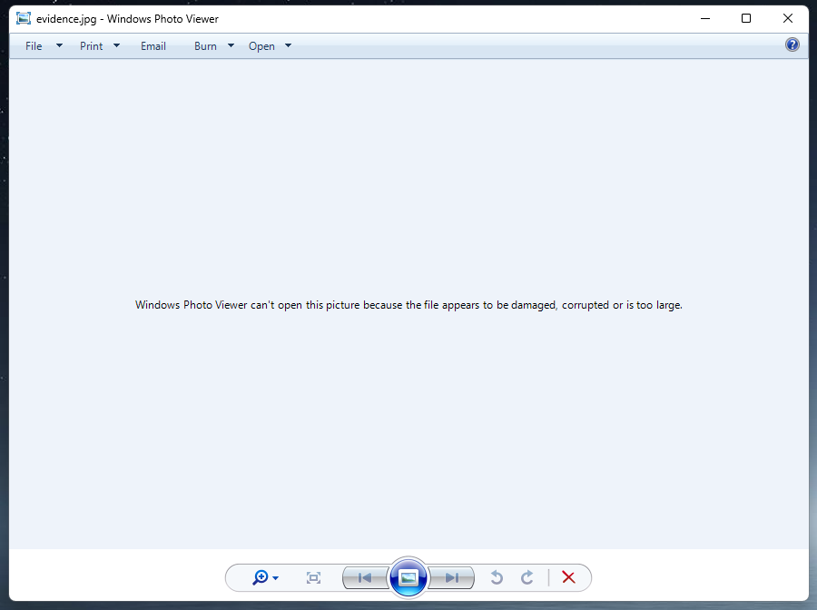
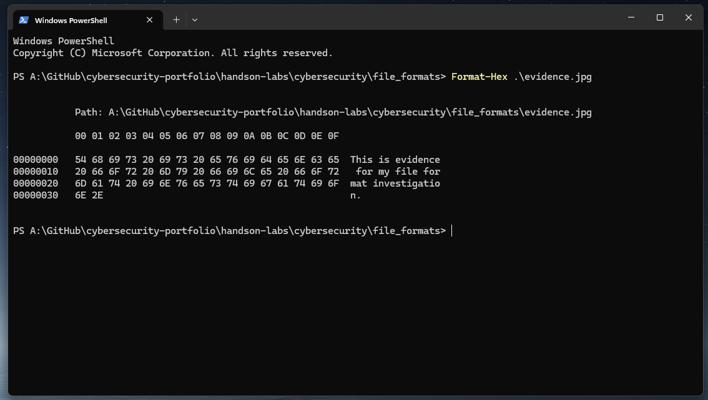

# 🧪 Lab 1: File Extensions vs Actual File Type
Lab Type: File Analysis / Cybersecurity Fundamentals   
Difficulty: Beginner

## 🎯 Objective
- Investigate the relationship between a file's extension and its actual contents.
- Observe what happens when a file extension is changed.
- Determine whether renaming a file changes the underlying data.
- Understand why relying only on file extensions can be a security risk.

## 🔬 Investigation
### Task 1 — Original Text File
I started by creating a text file called `evidence.txt` in Notepad and added the following content:

<table align="center"><tr> <td><pre>
"This is evidence for my file format investigation."
</pre> </td></tr> </table>

I then checked the **file's properties** in Windows.  

The file was identified as a **Text Document**, opened with **Notepad**, and had a size of **50 bytes**. 

At this point, everything matched as expected: the file contained plain text and had a `.txt` extension.

📸 **Figure 1** — Original `evidence.txt` file and its properties

  

### Task 2 - Change the File Extension 
Next, I renamed the file:

<table align="center"><tr> <td><pre>
evidence.txt → evidence.jpg
</pre> </td></tr> </table>

Windows warned me that changing the extension could make the file unusable.  
After accepting the warning, I checked the properties again.

Windows now identified the file as a **JPG File** and changed the default application from **Notepad** to **Photos**.

The file size also remained **50 bytes**.   
This suggested that changing the extension had not altered the file's contents, but further inspection was needed to confirm this.

📸 **Figure 2** — `evidence.jpg` after changing the extension

  

### Task 3 — Trying to Open the Renamed File
I then tried to open `evidence.jpg`.

Because Windows associated the `.jpg` extension with Photos, it attempted to open the file as an image.

Photos returned an error stating that the file was **damaged, corrupted, or too large**.

This made sense because I had never converted the text into an image. I had only renamed the file.

The next step was to look at the file's actual contents instead of relying on its extension.

📸 **Figure 3** — Windows Photo Viewer Error

  

### Task 4 — Inspecting the File in Hexadecimal
I opened **PowerShell** and inspected the file using:
<table align="center"><tr> <td><pre>
Format-Hex .\evidence.jpg
</pre> </td></tr> </table>

The output showed the actual bytes stored inside the file:
<table align="center"><tr> <td><pre>
54 68 69 73 20 69 73 20 ...
</pre> </td></tr> </table>

PowerShell also displayed their readable ASCII representation:
<table align="center"><tr> <td><pre>
This is evidence for my file format investigation.
</pre> </td></tr> </table>

So even though the filename was now `evidence.jpg`, the original text was still clearly visible inside the file.

A JPEG would normally begin with a file signature such as:
<table align="center"><tr> <td><pre>
FF D8 FF
</pre> </td></tr> </table>

My file did not contain this signature. Instead, its first bytes represented the word This:
<table align="center"><tr> <td><pre>
54 68 69 73
 T  h  i  s
</pre> </td></tr> </table>

This confirmed that changing `.txt` to `.jpg` had changed how Windows treated the file, but had not changed the data stored inside it.

📸 **Figure 4** — PowerShell Format-Hex showing the original text inside `evidence.jpg`

  

## 🧰 Tools Used
- Windows 11
- File Explorer
- Notepad
- Windows PowerShell

## 💡 Lessons Learned
- A file extension indicates the expected file type but does not prove what data the file actually contains.
- Renaming a file does not convert it to another file format.
- Operating systems may use file extensions to determine which application should open a file.
- File contents can be inspected directly rather than relying only on the filename.
- Hexadecimal inspection can reveal information about the actual data stored inside a file.
- File signatures can help identify a file's real format.
- Misleading file extensions can be relevant during cybersecurity investigations because a filename may disguise the actual type of a file.

