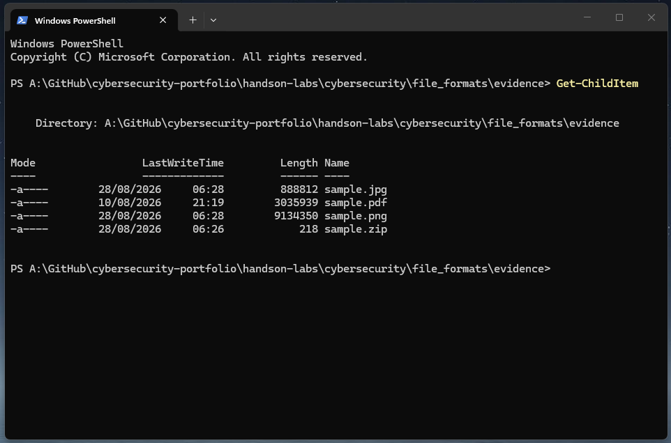
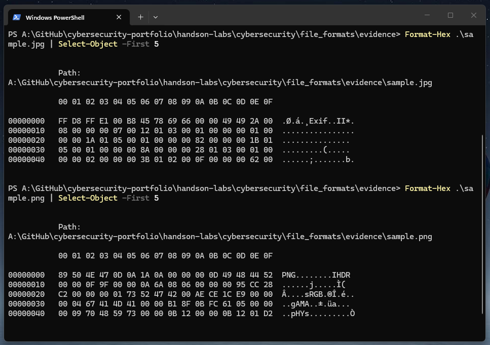
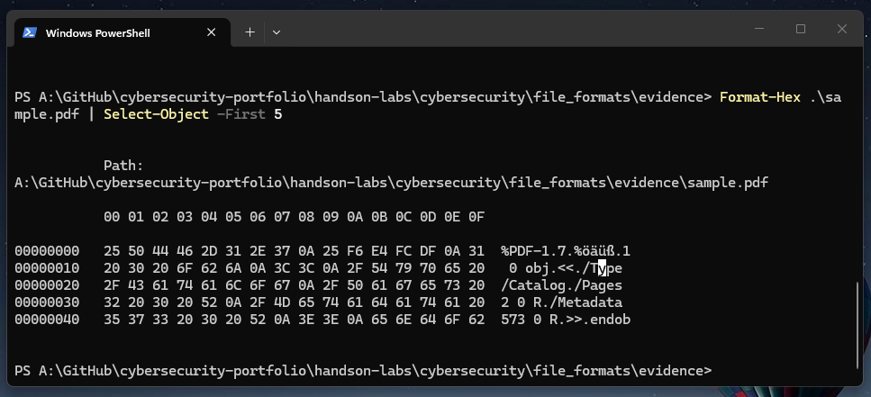
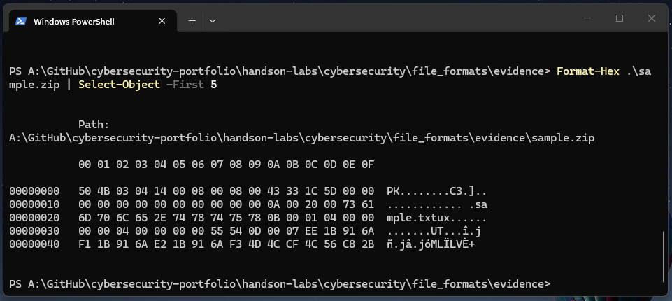

# 🧪 Lab 2: Identifying Files Using Magic Numbers
Lab Type: File Analysis / Cybersecurity Fundamentals   
Difficulty: Beginner

## 🎯 Objective
- Inspect the beginning of binary files.
- Locate and identify file signatures.
- Compare signatures between different file formats.
- Identify files without relying solely on their extensions.
- Understand how file signatures can assist when analysing suspicious files.

## 🔬 Investigation
### 📸 Figure 1 — Evidence Files
I began by opening PowerShell inside the `evidence` directory and used `Get-ChildItem` to confirm the files prepared for the investigation.  

  

The directory contained genuine JPEG, PNG, PDF and ZIP files.   
These files would then be examined individually without relying only on their extensions.

### 📸 Figure 2 — JPEG and PNG Signatures
I inspected the beginning of the JPEG and PNG files using `Format-Hex`.  
`Select-Object -First 5` was used to limit the output to the first few rows.

<table align="center"><tr> <td><pre>
Format-Hex .\sample.jpg | Select-Object -First 5
Format-Hex .\sample.png | Select-Object -First 5
</pre> </td></tr> </table>

  

The JPEG began with `FF D8 FF`, matching the expected JPEG signature. The output also contained `Exif`, indicating the presence of EXIF data near the beginning of this particular image.

The PNG began with `89 50 4E 47 0D 0A 1A 0A`. The bytes `50 4E 47` were also displayed as the readable characters `PNG`.

### 📸 Figure 3 — PDF File Signature
The PDF file was inspected using the same method. Its first bytes were `25 50 44 46`, which appeared as `%PDF` in the character representation. The header also displayed `%PDF-1.7`, identifying the version declared by this particular PDF.

<table align="center"><tr> <td><pre>
Format-Hex .\sample.pdf | Select-Object -First 5
</pre> </td></tr> </table>

<table align="center"><tr> <td><pre>
25 50 44 46 2D 31 2E 37
 %  P  D  F  -  1  .  7
</pre> </td></tr> </table>

  

### 📸 Figure 4 — ZIP File Signature
Finally, I inspected the ZIP archive. It began with `50 4B 03 04`, matching the expected ZIP signature. 

The first two bytes, `50 4B`, represent the ASCII characters `PK`. Interestingly, **PK does not stand for ZIP**. The initials come from **Phil Katz**, the developer of PKZIP and a key figure in the creation of the ZIP file format.

<table align="center"><tr> <td><pre>
Format-Hex .\sample.zip | Select-Object -First 5
</pre> </td></tr> </table>

<table align="center"><tr> <td><pre>
50 4B 03 04
 P  K
</pre> </td></tr> </table>

  

💡 Modern Microsoft Office formats such as `.docx`, `.xlsx`, and `.pptx` **are ZIP-based packages containing multiple files and folders**. Because of this, inspecting these files at byte level can reveal the same `PK` signature associated with ZIP files.

## 🧰 Tools Used
- Windows 11
- File Explorer
- Windows PowerShell
- `Get-ChildItem`
- `Format-Hex`
- `Select-Object`

## 💡 Lessons Learned
- File signatures provide evidence about a file's actual format rather than relying only on its extension.
- Different file formats contain recognisable byte patterns at the beginning of the file.
- Hexadecimal inspection can be used to identify and compare these signatures.
- Some signatures contain human-readable characters, such as `PNG`, `%PDF`, and `PK`.
- File signatures are useful when analysing unknown or suspicious files, although a matching signature alone does not prove that a file is safe or valid.

