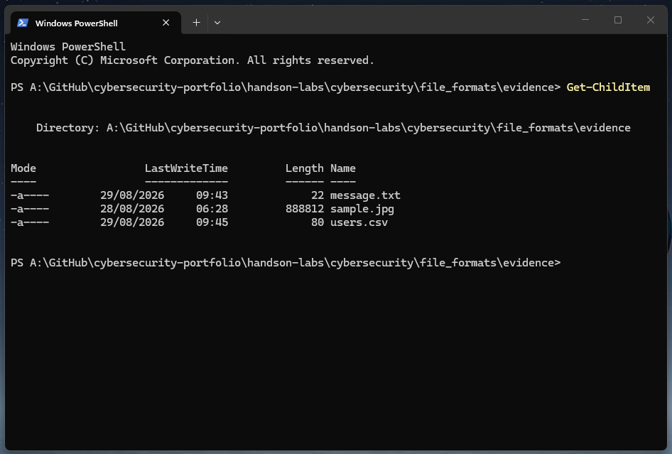
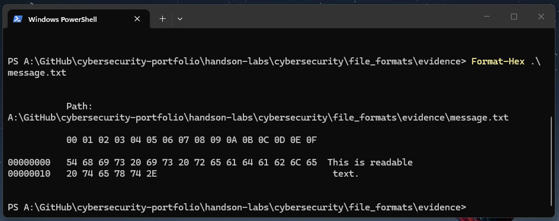
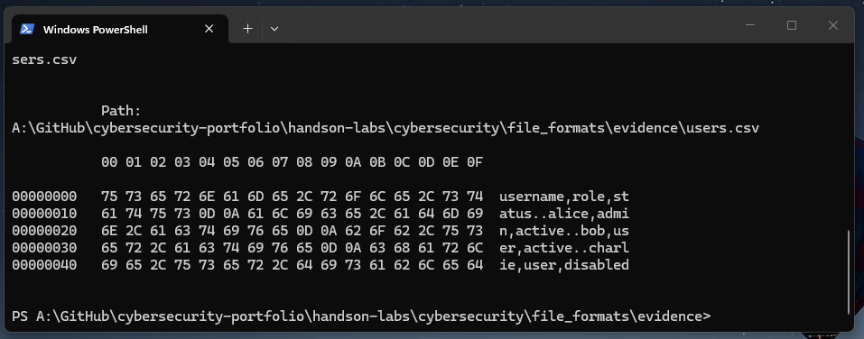
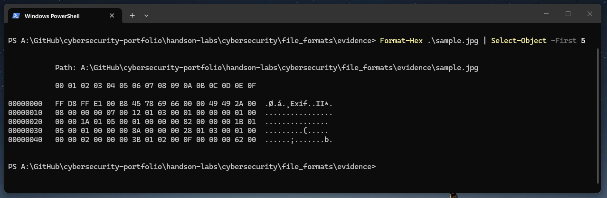

# 🧪 Lab 3: Text Files vs Binary Files
Lab Type: File Analysis / Cybersecurity Fundamentals   
Difficulty: Beginner

## 🎯 Objective
- Compare how text and binary files store data.
- Inspect TXT, CSV and JPEG files at byte level using hexadecimal analysis.
- Observe how text characters are represented by hexadecimal byte values.
- Examine how structured text such as CSV uses characters and line breaks to organise data.
- Identify differences between readable text data and binary file structures.

## 🔬 Investigation
### 📸 Figure 1 — Evidence Files
I began by opening PowerShell inside the `evidence` directory and used `Get-ChildItem` to confirm the files prepared for the investigation.  

  

The directory contained genuine JPEG, TXT and CSV files.   
These files would then be examined individually without relying only on their extensions.

### 📸 Figure 2 — Inspect the text file as raw bytes
<table align="center"><tr> <td><pre>
Format-Hex .\message.txt
</pre> </td></tr> </table>

<table align="center"><tr> <td><pre>
54 68 69 73 20 69 73 20 72 65 61 64 61 62 6C 65 20 74 65 78 74 2E
 T  h  i  s     i  s     r  e  a  d  a  b  l  e     t  e  x  t  .
</pre> </td></tr> </table>

The hexadecimal byte values corresponded directly to the characters stored in the text file.   
For example, `54 68 69 73` represented `This`, while `20` represented a space.

  

### 📸 Figure 3 — Inspect the CSV file as raw bytes
<table align="center"><tr> <td><pre>
Format-Hex .\users.csv
</pre> </td></tr> </table>

The CSV file also contained readable text when inspected at byte level. 
Although the file used a `.csv` extension rather than `.txt`, the character representation still showed the stored values, including the column names, usernames, roles and statuses.

The commas were also stored as individual characters. 
This showed that the CSV file was structured text, with commas being used to separate each value.

<table align="center"><tr> <td><pre>
0D = Carriage Return (CR)
0A = Line Feed (LF)
</pre> </td></tr> </table>

The byte sequence `0D 0A` also appeared between rows. These values represented the Windows-style line endings used to separate one line of text from the next.

  

### 📸 Figure 4 — Inspect the JPEG file as raw bytes
<table align="center"><tr> <td><pre>
Format-Hex .\sample.jpg | Select-Object -First 5
</pre> </td></tr> </table>

Unlike the TXT and CSV files, the JPEG did not contain continuously readable text in the character representation.

The file began with `FF D8 FF`, which matched the JPEG file signature identified in the previous lab. Some readable characters could still appear within the binary data, but the bytes were not a direct representation of the image that could be read as normal text.

This demonstrated an important difference between text and binary files. The TXT and CSV files stored information primarily as encoded characters, while the JPEG used bytes according to the structure of the JPEG file format.

  

## 🧰 Tools Used
- File Explorer
- Windows PowerShell
- `Get-ChildItem`
- `Format-Hex`
- `Select-Object`

## 💡 Lessons Learned
- Text files store characters as byte values that can be interpreted using a character encoding.
- File extensions such as `.txt` and `.csv` can represent different uses of textual data while still containing readable characters.
- CSV files use characters such as commas to organise text into a structured format.
- Binary files such as JPEG images use bytes according to a format-specific structure rather than storing the visible content as directly readable text.
- Binary files can still contain some readable strings, so the presence of readable characters does not automatically mean that a file is a text file.
- Hexadecimal inspection can help reveal how information is actually stored inside a file.

